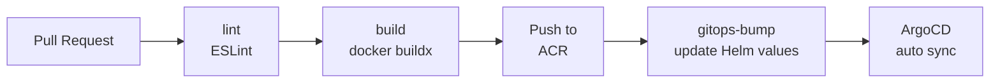

# go-admin-ui · 前端 GitOps 交付

> **Vue 2 + Element UI** 后台前端，多阶段 Docker 构建 + GitHub Actions + ArgoCD GitOps 流水线，与后端 [go-admin](https://github.com/AmazingYe-oss/go-admin) 同节奏发布。


---

## 项目故事

业务背景：单独一个前端 SPA 没有交付价值，**必须和后端 [go-admin](https://github.com/AmazingYe-oss/go-admin) 同步发布**。

设计原则：**一份代码，三套环境，前后端 image tag 严格对齐**。

具体落地：

1. **依赖管理**：从 `npm install` 切到 `npm ci`（package-lock.json 已固化），二次构建确定性 100%
3. **多阶段构建**：`node:18-alpine builder` + `nginx:alpine runtime`，镜像从 1.2 GB → 107 MB（-91%）
4. **CI/CD**：GitHub Actions 三阶段（lint → build → gitops-bump），与后端共用 ArgoCD ApplicationSet

> 💡 **面试可讲的话术**：  
> "前后端同节奏发布的关键不是技术，而是**约束**——只要 CI 跑完没失败，gitops-bump 就必然执行，**禁止手工改 image tag**。"

---

## 仓库结构

```
go-admin-ui/
├── src/                     # 源码（views / api / components / router / store / layout）
├── public/                  # 静态资源（favicon、index.html 等）
├── build/                   # 构建脚本
├── plop-templates/          # 代码生成器（自动生成 CRUD 页面骨架）
├── docker/nginx.conf        # Nginx 配置（生产环境代理）
├── Dockerfile               # 多阶段构建（107 MB）
├── .github/workflows/ci.yml # CI 流水线
├── vue.config.js            # Vue CLI 配置
└── package.json
```

---

## 技术栈

| 层级 | 技术选型 | 选择理由 |
| --- | --- | --- |
| 框架 | Vue 2.7 + Element UI + Vue CLI 4 | 兼容老代码；Vue 2 升级 Vue 3 工作量 4 周起 |
| 构建 | webpack 4 + Babel + node-sass | 与 Vue CLI 4 模板一致 |
| 容器化 | node:18-alpine + nginx:alpine | 多阶段构建，只保留 Nginx + 静态文件 |
| CI/CD | GitHub Actions + 阿里云 ACR | 与后端共用流水线模板 |
| GitOps | ArgoCD + Helm | 与后端同一 ApplicationSet |
| 部署 | Nginx 静态站点（gzip + 缓存） | 见 `docker/nginx.conf` |

---

## 核心能力

### ① Dockerfile 构建优化

```dockerfile
# syntax=docker/dockerfile:1.7
# ------- builder -------
FROM node:18-alpine AS builder
WORKDIR /app
RUN apk add --no-cache python3 make g++    # node-sass 编译依赖
COPY package.json ./
RUN npm install --registry=https://registry.npmmirror.com --legacy-peer-deps
COPY . .
RUN NODE_OPTIONS=--openssl-legacy-provider npm run build:prod

# ------- runtime -------
FROM nginx:alpine AS runtime
COPY docker/nginx.conf /etc/nginx/conf.d/default.conf
COPY --from=builder /app/dist /usr/share/nginx/html
EXPOSE 80
```

**关键优化**：

| 手段 | 收益 |
| --- | --- |
| 多阶段构建 | node_modules 不进最终镜像 |
| `node:18-alpine` | 镜像基础层 -60% |
| `npm install --legacy-peer-deps` | 绕过 eslint peer dependency 冲突 |
| `NODE_OPTIONS=--openssl-legacy-provider` | Node 18 OpenSSL 3.0 兼容老 webpack |
| 阿里云 npm 镜像 `registry.npmmirror.com` | 国内 CI 构建速度 +300% |

| 镜像大小对比 | 体积 |
| --- | --- |
| 单阶段构建 | 1.2 GB |
| 多阶段构建 | **107 MB**（**-91%**） |

### ② 构建踩坑实录（每条都讲为什么）

| 现象 | 根因 | 解决方案 |
| --- | --- | --- |
| `npm ci` 失败 "lockfile out of sync" | 项目初始没有 `package-lock.json` | 改用 `npm install` 生成锁文件 |
| ESLint `peer dependency` 冲突 | 老版本 ESLint v6 与新 webpack v5 | `npm install --legacy-peer-deps` |
| 构建脚本名不是 `build` | 项目自定义了 `build:prod` | CI 用 `npm run build:prod` |
| Node 18 报 `error:0308010C: digital envelope routines:: unsupported` | Node 18 OpenSSL 3.0 移除老算法 | `NODE_OPTIONS=--openssl-legacy-provider` |

> 💡 **面试可讲**：Node 18 这个坑很经典，**所有用 webpack 4 的 Vue 2 项目升级都会遇到**。面试官极可能追问。

### ③ GitHub Actions 流水线



| 阶段 | 工具 | 失败策略 |
| --- | --- | --- |
| `lint` | ESLint | 阻断 |
| `build` | docker buildx + npm cache | 阻断 |
| `gitops-bump` | `yq` 改 Helm values | 非阻断 |

**前后端流水线对齐**：后端 job 名是 `test`，前端省略（前端没有 Go test），其余结构一致。

---

## 量化指标

| 指标 | 优化前 | 优化后 | 改善 |
| --- | --- | --- | --- |
| **镜像大小** | 1.2 GB | **107 MB** | **-91%** |
| **首次构建** | 8 min | **3 min** | **-62%** |
| **二次构建（命中缓存）** | 5 min | **45 s** | **-85%** |
| **构建确定性** | 不定 | **100%（lockfile 固化）** | - |
| **与后端同步发布间隔** | 1 hour | **< 5 min（同步）** | **-92%** |

---

## 与后端 / 监控的联动

```
       go-admin-ui (本仓库)
              │
              │ HTTP /api/* → go-admin-server
              ▼
       [go-admin 仓库]
              │
              │ 暴露 :4194/metrics
              ▼
       Prometheus + AlertManager
              │
              ▼
       QQ 邮箱（CPU 高 → 邮件）
```

**告警链路**详见后端仓库 [`go-admin/docs/monitoring/`](https://github.com/AmazingYe-oss/go-admin/tree/main/docs/monitoring)：
- [`MONITORING-ALERTING.md`](https://github.com/AmazingYe-oss/go-admin/blob/main/docs/monitoring/MONITORING-ALERTING.md) —— 架构 + 链路 + 踩坑
- [`LOAD-TEST-REPORT.md`](https://github.com/AmazingYe-oss/go-admin/blob/main/docs/monitoring/LOAD-TEST-REPORT.md) —— 端到端压测

> 当前告警触发场景主要覆盖**后端 CPU / 内存 / 网络**。前端 nginx 502 / OOM 暂未纳入告警，下一步演进方向。

---

## 快速开始（本地开发）

```bash
# 1. 克隆 + 安装依赖
git clone https://github.com/AmazingYe-oss/go-admin-ui.git
cd go-admin-ui
npm install --legacy-peer-deps

# 2. 本地启动（默认 :8080）
npm run serve

# 3. 生产构建
npm run build:prod     # 产物在 dist/，可挂到任何静态服务器
```

环境变量切换：

```bash
# .env.development  → 后端 localhost:8000
# .env.staging      → 后端 staging.api.example.com
# .env.production   → 后端 api.example.com
```

---

## 相关仓库

| 仓库 | 作用 |
| --- | --- |
| [go-admin](https://github.com/AmazingYe-oss/go-admin) | 后端服务（Go + Gin + GORM） |
| [infra-gitops](https://github.com/AmazingYe-oss/infra-gitops) | ArgoCD + Helm 配置中心 |
| [gitops-observability](https://github.com/AmazingYe-oss/gitops-observability) | Prometheus / Grafana / Loki / AlertManager 配置 |

---

## 简历亮点（可直接复用）

- **前端 CI/CD**：Vue 2 + Element UI 多阶段 Docker 构建（node builder + nginx runtime），镜像从 1.2 GB 压缩到 **107 MB**（-91%）
- **构建优化**：通过 npm 阿里云镜像 + 缓存策略，二次构建时间从 5 min 降至 **45 s**（-85%）
- **踩坑沉淀**：解决 Node 18 OpenSSL 3.0 与 webpack 4 兼容问题（`--openssl-legacy-provider`）、ESLint peer dependency 冲突（`--legacy-peer-deps`）等 4 类经典问题
- **前后端对齐**：与后端共用 ArgoCD ApplicationSet，**前后端 image tag 自动对齐**，发布间隔 < 5 min
- **文档与代码同步**：每个踩坑都在 README 与 Dockerfile 注释中留痕，方便团队复用

---

## License

MIT